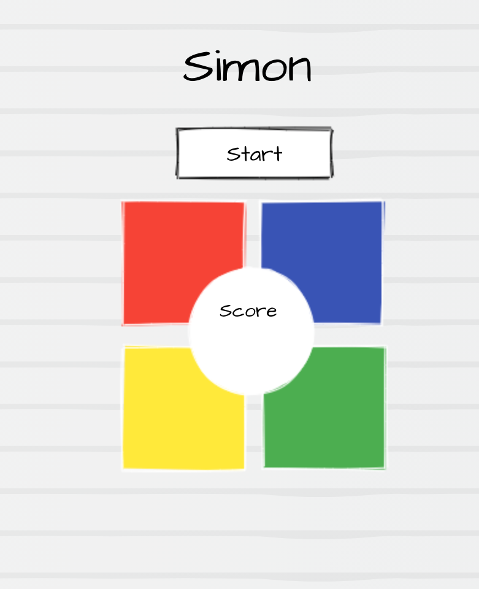
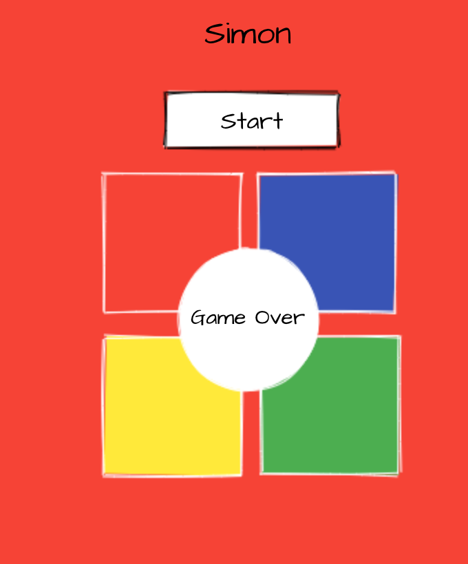

# Simon 

A new version of the classic Simon game from Hasbro Gaming, written in vanilla JavaScript

# Preview 

# Technologies Used 

JavaScript | HTML | CSS 

# Installation Instructions 

* Fork and clone this repository 
* Start up local server and open index.html 
* Follow in app instructions on how to play Simon

# User Stories 

- As a player, I need to see the game board so I can get a visual of where I need to click
- As a player, I need to have a start button so I can tell the game when I am ready to play
- As a player, I want to see a score or level tally so that I can keep track of my progress in the game
- As a player, I need to see a visual indication of the sequence such as a flash, so that I can recreate the pattern with clicks
- As a player, I want to see an indication of when the game is over, so that I know I guessed incorrectly and need to start a new game
- As a player, I want an option to see instructions so that if I have a question on how to play this can be answered

# Wireframes 

# Hurdles 

My first initial hurdles was getting the sequence to flash at the correct times. It took a lot of finess to find a time frame for the sequence to run that was not too slow that the player would get bored, but not too quick that the player would miss the prompt
My next hurldle was to solve the issue of a user clicking on the screen while the computers sequence was still running. If the user clicked any of the color squares while the computer sequence was running, this would create a glitch and cause the player sequence to be incorrect at the start of the next round.
I was able to solve this by adding a sequence running boolean to the constructor in the game class. If the game is running then the boolean will return true and the click events for the player will not be registered. When the sequence is completed for each round, the boolean is toggles to false and the user may click and make their choices for the sequence. 

# Unsolved Problems 

When the user clicks the reset button while playing the game, the score and sequences reset to a new game. However, the previous running sequence needs to run to completetion before beginning a new sequence. 
This does not affect user play, as the user is still able to begin a new game, however it does create an unnecessary wait time that I would like to eliminate 
> status: actively working on finding a solution 
